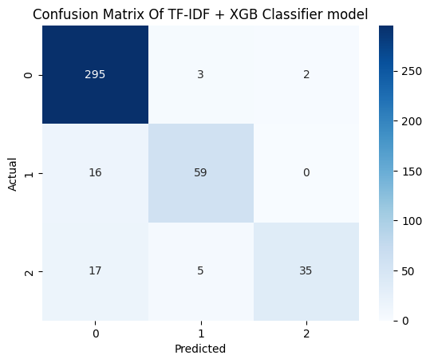
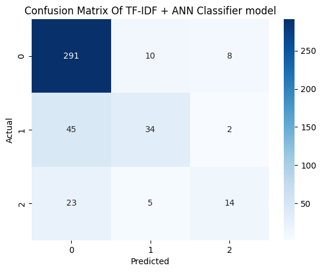

# Sentimen Analysis on Keluhan Istri Data

- **Dataset:** Data Keluhan Istri (Data/RawData.csv)
- **Tasks:** Indonesian Text Cleaning, Sentiment Classification (multi-class)
- **Metrics:** Macro F1 Score
- **Goal:** Membangun model klasifikasi sentimen untuk teks keluhan istri berbahasa Indonesia (informal & campur-campur), dengan fokus pada preprocessing bahasa Indonesia dan evaluasi menggunakan F1 (macro) agar kelas minoritas tetap terjaga performanya.

## 📌 Overview

- Teks keluhan bersifat panjang, emosional, dan sangat informal (slang, campuran bahasa, emoji).
- **Tujuan:** membangun model yang bisa mengklasifikasikan keluhan ke beberapa label sentimen sehingga bisa dianalisis lebih lanjut (misalnya untuk insight psikologis/sosial).
- Workflow utama:
  1. EDA.
  2. Pembersihan & normalisasi teks bahasa Indonesia.
  3. TF-IDF feature extraction.
  4. Modeling dengan XGBoost dan ANN (PyTorch + Optuna).
  5. Evaluasi dengan macro F1.

## 📊 Exploratory Data Analysis

**Notebook:** 01EDA.ipynb & 03CleanedEDA.ipynb

- ±3k baris teks keluhan dengan label numerik.
- Tidak ada missing value di kolom utama, tapi ada duplikasi yang di-drop pada tahap cleaning.
- EDA mencakup:
  - Distribusi kelas label.
  - Panjang teks (kata/karakter).
  - Kata & n-gram yang sering muncul (mis. via WordCloud).

## 🧹 Text Cleaning (Bahasa Indonesia)

**Notebook:** 02DataCleaning.ipynb

**Langkah utama:**

- Lowercase.
- Menghapus emoji, URL, angka tak relevan, dan karakter non-alfabet.
- Normalisasi spasi dan line break.
- Stopwords bahasa Indonesia + beberapa kata domain-spesifik.
- Normalisasi slang (misal variasi “bund/bunda/bun”) dengan kamus.

**Output:** Clean Data (Data/CleanData.csv) berisi kolom text (bersih) dan label.

## 🤖 Modeling

**Notebook:** 04XGBModel.ipynb & 05ANNModel.ipynb

### Feature Representation:

- TF-IDF (unigram + n-gram) menggunakan TfidfVectorizer (scikit-learn).

### Models:

- Baseline: TF-IDF + XGBClassifier
- Advance: TF-IDF + ANN

### Hyperparameter Tuning

- GridSearchCV untuk hyperparameter tuning

## 📈 Results & Interpretation

### 🔢 Ringkasan Performa Model

Tabel berikut merangkum hasil utama pada **test set** (macro F1, macro precision, dan macro recall).

| Model                           | Dataset | Macro F1 | Precision (macro) | Recall (macro) |
| ------------------------------- | ------- | -------- | ----------------- | -------------- |
| TF-IDF + XGBClassifier          | Test    | 0.84     | 0.91              | 0.79           |
| TF-IDF + ANN (PyTorch + Optuna) | Test    | 0.61     | 0.70              | 0.56           |

- **Akurasi XGBClassifier:** 0.90
- **Akurasi ANN:** 0.78

### 🧪 Hasil Utama

- Model dengan performa terbaik adalah **TF-IDF + XGBClassifier** dengan **macro F1 = 0.84**, **macro precision = 0.91**, dan **macro recall = 0.79** pada test set.
- Model **TF-IDF + ANN (PyTorch + Optuna)** mendapatkan **macro F1 = 0.61**, **macro precision = 0.70**, dan **macro recall = 0.56**, sehingga masih tertinggal cukup jauh dari XGBClassifier.
- Secara umum:
  - XGBClassifier lebih stabil di semua kelas, dengan kombinasi precision dan recall yang seimbang.
  - ANN cenderung masih kesulitan terutama di kelas minoritas, yang terlihat dari macro recall yang lebih rendah (0.56).

### Confusion Matrix

